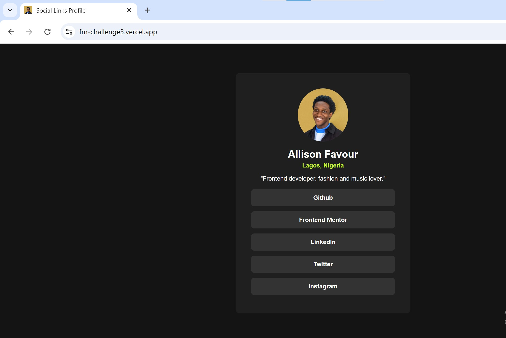

# Frontend Mentor - Social links profile solution

This is a solution to the [Social links profile challenge on Frontend Mentor](https://www.frontendmentor.io/challenges/social-links-profile-UG32l9m6dQ). Frontend Mentor challenges help you improve your coding skills by building realistic projects. 

## Table of contents

- [Overview](#overview)
  - [Screenshot](#screenshot)
  - [Links](#links)
- [My process](#my-process)
  - [Built with](#built-with)
  - [What I learned](#what-i-learned)
  - [Continued development](#continued-development)
- [Author](#author)
- [Acknowledgments](#acknowledgments)

## Overview

### Screenshot

### Links

- Solution URL: [Github repo to the code for the challenge](https://github.com/AllisonFavour/fm-challenge3)
- Live Site URL: [Vercel link to view the challenge](https://fm-challenge3.vercel.app)

## My process

Started by using HTML to give the structure of the layout and having the CSS styling in mind.

### Built with

- Semantic HTML5 markup
- CSS custom properties and Flexbox

### What I learned

I learnt to visualize my solutions first before coding it out. After taking my time to analyse the image preview of the expected solution then i dived first with building the structure of the layout with HTML.

In my HTML file, i started by using the main tag and then using a div with the class name of .main which is a parent to another div with the class name of .container. The reason for this procedure is to center the div and its children elements.

The .container div is a parent to the rest of the contents like the image and anchor tags used for the profile links. 

Heading to the CSS file, i started with the css reset and then giving the appropriate styles to achieve a similar out as the expected image preview. I tried using a simple approach so my code is self explanatory or at least easy to follow up.

### Continued development

Hopefully, as time goes on i will get to learn about more on accessibility, because while thinking about it, i realized how essential it is to follow a top accessibility and HTML semantic approach to help with all kinds of users trying to access our websites and web apps.

## Author

- Website - [Allison Favour](https://allison-favour-portfolio-darkmode.vercel.app/)
- Frontend Mentor - [@AllisonFavour](https://www.frontendmentor.io/profile/AllisonFavour)
- Twitter - [@TrillestOjay](https://x.com/TrillestOjay)

## Acknowledgments

Thanks to myself for starting and finishing this particular project, also thanks to my other projects for serving as a reference.